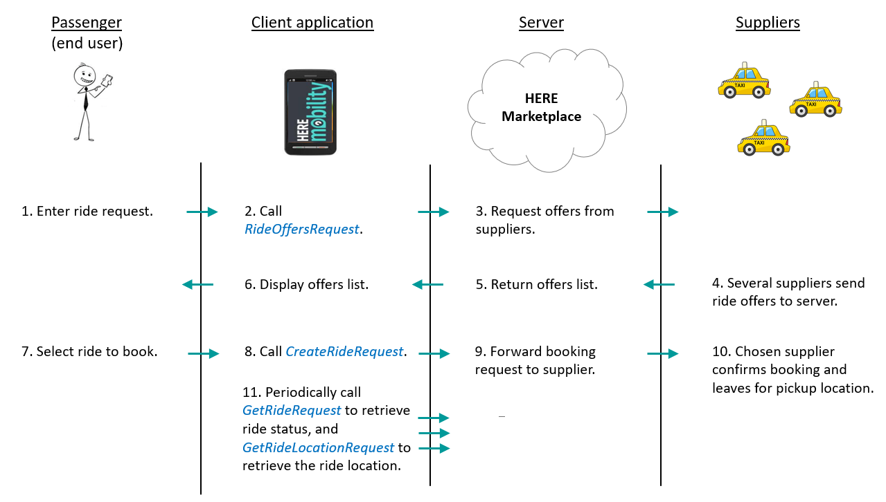

# HERE Demand API Common Workflows #

The diagram below illustrates the typical workflow for booking a ride and updating its status during the ride.

----
The pages listed below describe some common workflows you can implement using the Demand API. The descriptions include code samples for the REST and GRPC interfaces.

[Requesting and Booking a Ride](DemandDevGuide_BookRide.md)
[Getting a Ride Object](DemandDevGuide_GetRide.md)
[Getting a Ride's Location](DemandDevGuide_GetRideLocation.md)
[Cancelling a Ride](DemandDevGuide_CancelRide.md)
[Querying for Rides](DemandDevGuide_QueryRides.md)

