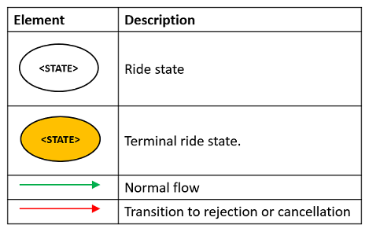

# Ride States and Transitions #

## Ride States ##

Rides have different states throughout their lifetime. The following table describes the possible ride state values:

State | Description
:------|:---------------
UNKNOWN	| Unknown status
PROCESSING	| Looking for a supplier
REJECTED	| The supplier cannot fulfill the ride request
ACCEPTED	| The supplier accepted the request; a driver is not yet assigned
DRIVER_ASSIGNED	| A driver has been assigned to the ride request
DRIVER_EN_ROUTE	| The vehicle is en route to the pickup location
AT_PICKUP	| The vehicle is at the pickup location
PASSENGER_ON_BOARD	| The passenger is onboard; the vehicle is en route to the dropoff location
AT_DROPOFF	| The vehicle is at the dropoff location
COMPLETED	| The ride was completed successfully
CANCELLED	| The ride was cancelled by the supplier or by the client.

## Ride State Transitions ##

The following diagram and legend describe the various ride state transitions that can occur throughout a ride's lifetime.

>**Notes:** 
>* The orange nodes in the diagram indicate terminal states, which cannot transition to any other state.
>* In the case of a pre-booked (future) ride, the ride remains in the ACCEPTED state for a longer period of time, and only transitions to DRIVER_ASSIGNED shortly before the pickup time.

----

**Legend:**

